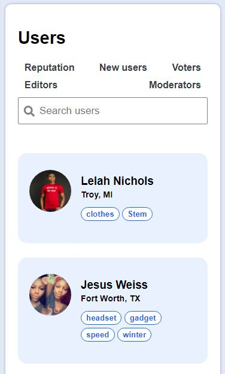
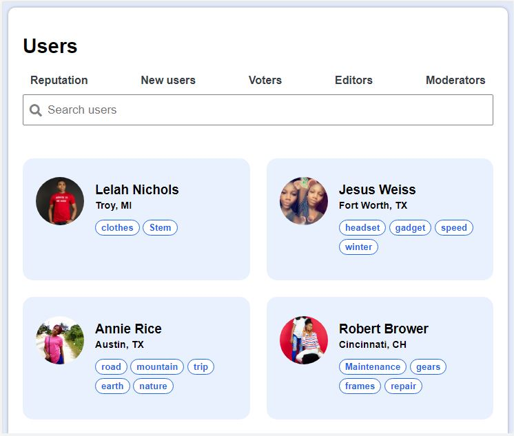
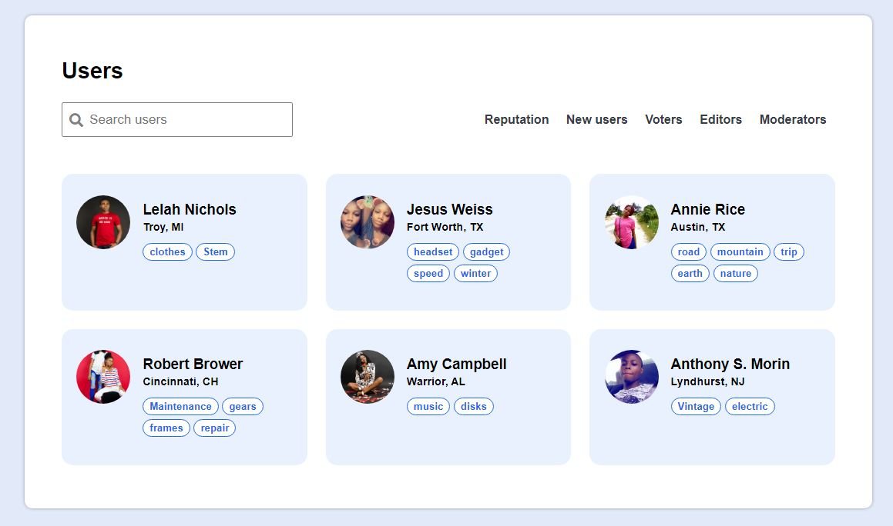

# users-card
# Developer Students' Club - Users card

## Table of contents

- [Overview](#overview)
  - [The challenge](#the-challenge)
  - [Screenshot](#screenshot)
  - [Links](#links)
- [My process](#my-process)
  - [Built with](#built-with)
  - [Continued development](#continued-development)
  - [Useful resources](#useful-resources)
- [Author](#author)
- [Acknowledgments](#acknowledgments)

## Overview

### The challenge

This is a task to replicate the design on the template using semantic HTML and CSS

### Screenshot

### Links

-  [ Solution URL ](https://github.com/Austinet/users-card.git)
-  [Live site](https://Austinet.github.io/users-card/)

## My process

### Built with

- Semantic HTML5 markup
- CSS custom properties
- CSS Flexbox
- CSS Grid
- Desktop-first workflow
- Visual Studio Code

### Continued development

Keep taking up projects and keep improving

### Useful resources

- [ Youtube](https://www.Youtube.com) 
- [Google  ](https://www.Google.com) 

## Author

- Frontend Mentor - [@austinet](https://www.frontendmentor.io/profile/austinet)
- Twitter - [@udhe.austine](https://www.twitter.com/udhe.austine)
- Resume - [Austinet](https://www.austinet.github.io/resume/)
- Linkedin - [Udhe Austine Ogaga](https://www.linkedin.com/in/udhe-austine-ogaga-25961820b)

## Acknowledgments

I will like to acknowledge God for giving me the grace to keep up with the good work.And also appreciating DSC team and fellow learners, Google, Youtube and ctrl+z lol.
